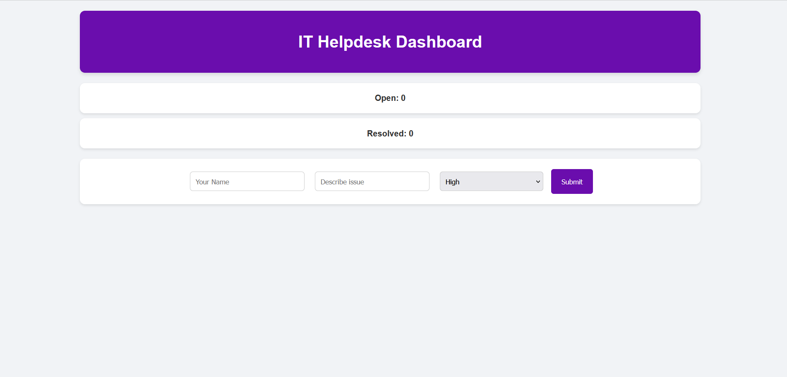
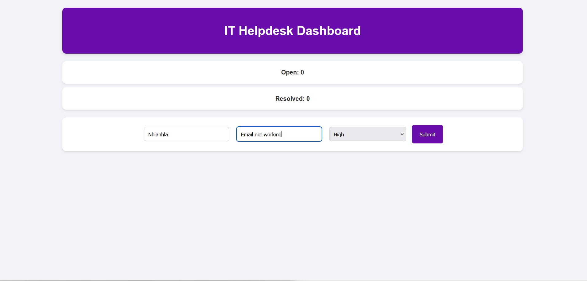
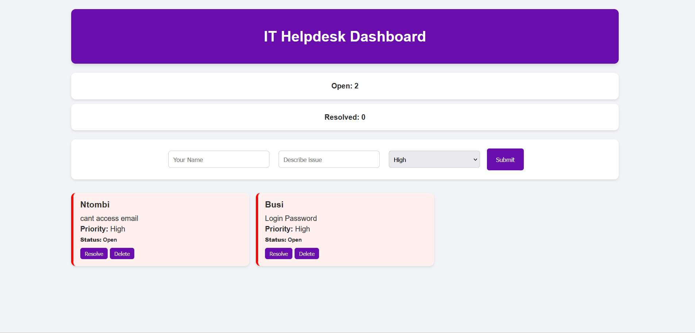
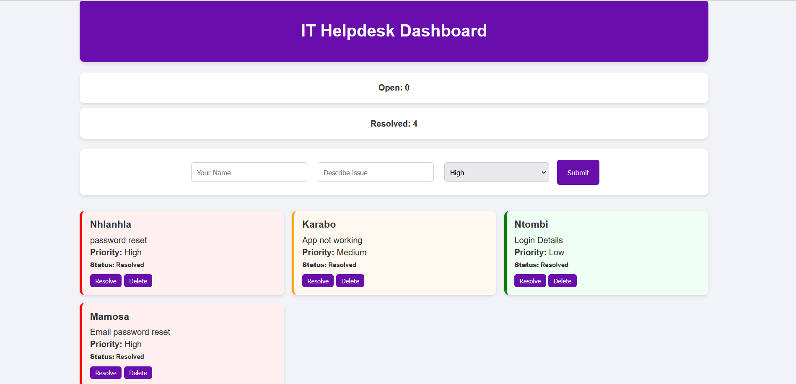

# 💻 IT Helpdesk Dashboard

A fully functional IT Helpdesk Ticket System built with HTML, CSS, and JavaScript.  
This dashboard allows users to log, track, and manage support tickets, simulating a real-world IT support environment.

## 🌐 Live Demo
🔗 [View Live](https://imma1114.github.io/helpdesk-ticket-system/)

## 📌 Features
- Create support tickets with user name and issue description  
- Set ticket priority: **High**, **Medium**, **Low**  
- Track ticket status: **Open / Resolved**  
- Delete tickets  
- Dashboard with live statistics  
- Data persistence using **Local Storage**  

## 🛠️ Technologies Used
HTML | CSS | JavaScript  

## 📸 Screenshots
### Dashboard Overview

### Adding a Ticket

### Ticket Priority & Status

### Resolved Tickets

## 🎯 Purpose
This project was created to demonstrate my ability to build functional web applications and simulate real-world IT support systems.

## 📚 What I Learned
- DOM manipulation & event handling  
- Local Storage for data persistence  
- Building responsive, user-friendly interfaces  

## 🙋‍♀️ Author
**Immaculate Nhlanhla Modise**  
- 💼 LinkedIn: [linkedin.com/in/immaculatemodise](https://www.linkedin.com/in/immaculatemodise)  
- 💻 GitHub: [github.com/imma1114](https://github.com/imma1114)
